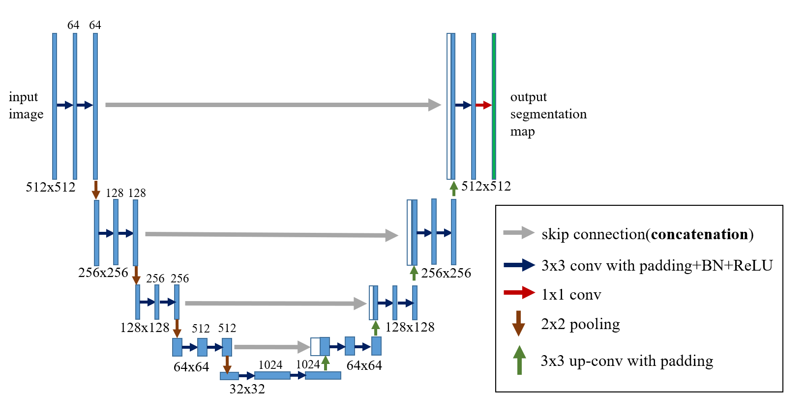

# tf2_Segmentation

  

It's a framework of image segmentation implemented in tensorflow 2.x.

There're U-Net、DeepLabV3+、BESNet in this framework.

**U-Net**: Convolutional Networks for Biomedical Image Segmentation by Olaf Ronneberger, Philipp Fischer, Thomas Brox (https://arxiv.org/abs/1505.04597).



**DeepLabV3+**: Encoder-Decoder with Atrous Separable Convolution for Semantic Image Segmentation by Liang-Chieh Chen, Yukun Zhu, George Papandreou, Florian Schroff, Hartwig Adam (https://arxiv.org/abs/1802.02611).


**BESNet**: Boundary-Enhanced Segmentation of Cells in Histopathological Images by Hirohisa Oda, Holger R. Roth et al. (https://link.springer.com/chapter/10.1007/978-3-030-00934-2_26).

# Table of Contents

- [tf2_Segmentation](#tf2_segmentation)
- [Table of Contents](#table-of-contents)
- [Usage](#usage)
- [Sample application](#sample-application)
  - [CamVid](#camvid)
- [API reference](#api-reference)
  - [models](#models)
    - [model_predict function](#model_predict-function)
    - [unet function](#unet-function)
    - [deeplabv3 function](#deeplabv3-function)
    - [besnet function](#besnet-function)
    - [mbesnet function](#mbesnet-function)
    - [resunet function](#resunet-function)
  - [losses](#losses)
    - [balanced_categorical_crossentropy function](#balanced_categorical_crossentropy-function)
    - [balanced_binary_crossentropy function](#balanced_binary_crossentropy-function)
    - [categorical_be_crossentropy function](#categorical_be_crossentropy-function)
    - [binary_be_crossentropy function](#binary_be_crossentropy-function)
    - [dice_loss_func function](#dice_loss_func-function)
    - [binary_dice_loss_func function](#binary_dice_loss_func-function)
  - [metrics](#metrics)
    - [be_binary_accuracy function](#be_binary_accuracy-function)
    - [dice_coef_func function](#dice_coef_func-function)
    - [jaccard_index_func function](#jaccard_index_func-function)
  - [utils](#utils)
    - [The Segdata_reader class](#the-segdata_reader-class)
      - [Segdata_reader class](#segdata_reader-class)
      - [labelme_json_to_dataset method](#labelme_json_to_dataset-method)
      - [imglayer_to_dataset method](#imglayer_to_dataset-method)
      - [labelme_json_to_sequence method](#labelme_json_to_sequence-method)
      - [imglayer_to_sequence method](#imglayer_to_sequence-method)
    - [read_img function](#read_img-function)
    - [vis_img_mask function](#vis_img_mask-function)
    - [plot_history function](#plot_history-function)
    - [get_class_weight function](#get_class_weight-function)
    - [get_jaccard function](#get_jaccard-function)
    - [get_dice function](#get_dice-function)
    - [create_confusion_mat function](#create_confusion_mat-function)
    - [create_score_mat function](#create_score_mat-function)

# Usage

1. Clone or download
    - Use the command bellow in terminal to git clone:    
    ```git clone https://github.com/samson6460/tf2_Segmentation.git```

    - Or just download whole files using the **[Code > Download ZIP]** button in the upper right corner.
    
2. Install dependent packages: 
    ```pip install -r requirements.txt```

3. Import tf2_Segmentation:
   ```import tf2_Segmentation```


# Sample application

## CamVid

The Cambridge-driving Labeled Video Database (CamVid) is the first collection of videos with object class semantic labels, complete with metadata. The database provides ground truth labels that associate each pixel with one of 32 semantic classes.


[Open sample code in Colab](https://colab.research.google.com/drive/1SzpmM15YRR4hy0dKAbCsi6-FeYzGJhR2?usp=sharing)

*dataset from: https://github.com/PengKiKi/camvid*


# API reference

## models

### model_predict function
```
tf2_Segmentation.models.model_predict(
    model, intput_tensor,
    classifi_mode="one", **kargs)
```
A function like `model.predict_classes()`.

Call `model_predict()` to predict and convert the prediction from probabilities to one-hot encoding or binary encoding.

**Arguments**
- **model**: tf.kears model instance.
- **intput_tensor**: tf.keras tensor.
- **classifi_mode**: A string, Specifying the encoding method.
Default: "one", which means one-hot encoding.
    
**Returns**

Prediction of one-hot encoding or binary encoding.

---

### unet function
```
tf2_Segmentation.models.unet(
    pretrained_weights=None,
    input_shape=(512, 512, 3),
    activation='relu',
    categorical_num=4,
    classifi_mode='one')
```
Create U-Net architecture.
    
**Arguments**
- **pretrained_weights**: A string, file path of pretrained model.
- **input_shape**: A tuple of 3 integers, shape of input image.
- **activation**: A string, activation function for convolutional layer.
- **categorical_num**: An integer, number of categories without background.
- **classifi_mode**: A string, one of 'one'、'binary'、'multi'.
If specified as 'one', it means that the activation function of the output layer is softmax, and the label  should be one-hot encoding.

**Returns**

A tf.keras Model.

---

### deeplabv3 function
```
tf2_Segmentation.models.deeplabv3(
    pretrained_weights='pascal_voc',
    input_tensor=None,
    input_shape=(512, 512, 3),
    categorical_num=4,
    backbone='xception',
    OS=16, alpha=1.,
    classifi_mode="one")
```
Instantiates the Deeplabv3+ architecture.

Optionally loads weights pre-trained on PASCAL VOC or Cityscapes.
This model is available for TensorFlow only.

**Arguments**
- **pretrained_weights**: one of 'pascal_voc' (pre-trained on pascal voc), 'cityscapes' (pre-trained on cityscape) or local file path of pretrained model or None (random initialization).
- **input_tensor**: optional Keras tensor (i.e. output of `layers.Input()`) to use as image input for the model.
- **input_shape**: shape of input image. format HxWxC PASCAL VOC model was trained on (512, 512, 3) images.
    None is allowed as shape/width.
- **classes**: number of desired classes (will be deprecated).
    PASCAL VOC has 21 classes, Cityscapes has 19 classes.
    If number of classes not aligned with the weights used,
    last layer is initialized randomly.
- **categorical_num**: An integer, number of categories without background.
    PASCAL VOC has 20 categories, Cityscapes has 18 categories.
    If number of categories not aligned with the weights used,
    last layer is initialized randomly.
- **backbone**: backbone to use. one of {'xception','mobilenetv2'}
- **OS**: determines input_shape/feature_extractor_output ratio.
    One of {8,16}.
    Used only for xception backbone.
- **alpha**: controls the width of the MobileNetV2 network.
    This is known as the width multiplier in the MobileNetV2 paper.
  - If `alpha` < 1.0, proportionally decreases the number of filters in each layer.
  - If `alpha` > 1.0, proportionally increases the number of filters in each layer.
  - If `alpha` = 1, default number of filters from the paper are used at each layer.
    Used only for mobilenetv2 backbone.
    Pretrained is only available for alpha=1.
- **activation**: optional activation to add to the top of the network.
    One of 'softmax', 'sigmoid' or None.
- **classifi_mode**: A string, one of 'one'、'binary'、'multi'.
    If specified as 'one', it means that the activation function of the output layer is softmax, and the label should be one-hot encoding.

**Returns**

A tf.keras model instance.

**Raises**
- **RuntimeError**: If attempting to run this model with a backend that does not support separable convolutions.
- **ValueError**: in case of invalid argument for `backbone`.

---

### besnet function
```
tf2_Segmentation.models.besnet(
    pretrained_weights=None,
    input_shape=(512, 512, 3),
    activation='selu',
    categorical_num=4,
    classifi_mode='one')
```
Create BES-Net network architecture.

**Arguments**

- **pretrained_weights**: A string, file path of pretrained model.
- **input_shape**: A tuple of 3 integers, shape of input image.
- **activation**: A string, activation function for convolutional layer.
- **categorical_num**: An integer, number of categories without background.
- **classifi_mode**: A string, one of 'one'、'binary'、'multi'.
    If specified as 'one', it means that the activation function of the output layer is softmax, and the label should be one-hot encoding.

**Returns**

A tf.keras Model.

---

### mbesnet function
```
tf2_Segmentation.models.mbesnet(
    pretrained_weights=None,
    input_shape=(512, 512, 3),
    activation='relu',
    categorical_num=4,
    classifi_mode='one')
```
Create mBES-Net network architecture.

**Arguments**
- **pretrained_weights**: A string, file path of pretrained model.
- **input_shape**: A tuple of 3 integers, shape of input image.
- **activation**: A string, activation function for convolutional layer.
- **categorical_num**: An integer, number of categories without background.
- **classifi_mode**: A string, one of 'one'、'binary'、'multi'.
    If specified as 'one', it means that the activation function  of the output layer is softmax, and the label should be one-hot encoding.

**Returns**

A tf.keras Model.

---

### resunet function
```
tf2_Segmentation.models.resunet(
    resnet_func=ResNet152,
    input_shape=(512, 512, 3),
    pretrained_backbone="imagenet",
    pretrained_weights=None,
    upskip_id=[-33, 120, 38, 4],
    res_num_blocks=[36, 8, 3, 1],
    categorical_num=1,
    classifi_mode="one"):
```
Create ResU-Net network architecture.

**Arguments**
- **resnet_func**: A Resnet from tensorflow.keras.applications.
    e.g., tensorflow.keras.applications.ResNet152.
- **input_shape**: A tuple of 3 integers,
    shape of input image.
- **pretrained_backbone**: one of None (random initialization), 'imagenet' (pre-training on ImageNet), or the path to the weights file to be loaded.
- **pretrained_weights**: A string, 
    file path of pretrained model.
- **upskip_id**: A list of integer,
    index of skip connections from extracting path.
- **res_num_blocks**: A list of integer.
    number of repetitions of up-residual blocks.
- **categorical_num**: An integer,
    number of categories
- **classifi_mode**: A string, one of 'one'、'binary'、'multi'.
    If specified as 'one', it means that the activation function  of the output layer is softmax, and the label should be one-hot encoding.

**Returns**

A tf.keras Model.

------

## losses

### balanced_categorical_crossentropy function
```
tf2_Segmentation.losses.balanced_categorical_crossentropy(class_weight=1)
```

**Arguments**
- **class_weight**: Optional `class_weight` acts as reduction weighting coefficient for the per-class losses. If a scalar is provided, then the loss is simply scaled by the given value.

**Returns**

A tf2 loss function.

---

### balanced_binary_crossentropy function
```
tf2_Segmentation.losses.balanced_binary_crossentropy(class_weight=1, binary_weight=1)
```

**Arguments**
- **class_weight**: Optional `class_weight` acts as reduction weighting coefficient for the per-class losses. If a scalar is provided, then the loss is simply scaled by the given value.
- **binary_weight**: Optional `binary_weight` acts as reduction weighting coefficient for the positive and negative losses.

**Returns**

A tf2 loss function.

---

### categorical_be_crossentropy function
```
tf2_Segmentation.losses.categorical_be_crossentropy(
    ce_class_weight=1,
    bece_class_weight=1,
    alpha=0.5, beta=0.1)
```
Loss function for BESNet.

**Arguments**
- **ce_class_weight**: Class weight of crossentropy.
- **bece_class_weight**: Class weight of boundary enhanced crossentropy.
- **alpha**: A float.
- **beta**: A float.

**Returns**

A tf2 loss function.

---

### binary_be_crossentropy function
```
tf2_Segmentation.losses.binary_be_crossentropy(
    ce_class_weight=1,
    bece_class_weight=1,
    ce_binary_weight=1,
    binary_weight=1,
    alpha=0.5, beta=0.1)
```
Loss function for BESNet.

**Arguments**
- **ce_class_weight**: Class weight of crossentropy.
- **bece_class_weight**: Class weight of boundary enhanced crossentropy.
- **ce_binary_weight**: Class weight of binary crossentropy.
- **binary_weight**: Class weight of boundary enhanced binary crossentropy.
- **alpha**: A float.
- **beta**: A float.

**Returns**

A tf2 loss function.

---

### dice_loss_func function
```
tf2_Segmentation.losses.dice_loss_func(smooth=1)
```
Dice loss function.

**Arguments**
- **smooth**: An integer.
- **class_weight**: A float or an array like.
- **beta**: A float, f-score coefficient.

**Returns**

A tf2 loss function.

---

### binary_dice_loss_func function
```
tf2_Segmentation.losses.binary_dice_loss_func(smooth=1)
```
Binary dice loss function.

**Arguments**
- **smooth**: An integer.
- **class_weight**: A float or an array like.
- **beta**: A float, f-score coefficient.

**Returns**

A tf2 loss function.

------

## metrics

### be_binary_accuracy function
```
tf2_Segmentation.metrics.be_binary_accuracy(y_true, y_pred)
```
Accuracy function for BESNet.

**Arguments**
- **y_true**: Ground truth values.
- **y_pred**: The predicted values.

**Returns**

Accuracy values.

---

### dice_coef_func function
```
tf2_Segmentation.metrics.dice_coef_func(smooth=1, threshold=0.5):
```
Dice coefficient function.

**Arguments**
- **smooth**: An integer.
- **threshold**: An integer.

**Returns**

Dice coefficient function.

---

### jaccard_index_func function
```
tf2_Segmentation.metrics.jaccard_index_func(smooth=1)
```
Jaccard index function.

**Arguments**
- **smooth**: An integer.
- **threshold**: An integer.

**Returns**

Jaccard index function.

------

## utils

### The Segdata_reader class

#### Segdata_reader class
```
tf2_Segmentation.utils.Segdata_reader(
    rescale=None,
    preprocessing=None,
    augmenter=None,
    aug_times=1)
```
Read the images and annotations for segmentation.

**Arguments**
- **rescale**: A float or None, specifying how the image value should be scaled.
    If None, no scaled.
- **preprocessing**: A function of data preprocessing,
    (e.g. noralization, shape manipulation, etc.)
- **augmenter**: A `imgaug.augmenters.meta.Sequential` or `albumentations.core.composition.Compose` instance.
- **aug_times**: An integer.
  The default is 1, which means no augmentation.

**Attributes**
- **rescale**
- **preprocessing**
- **augmenter**
- **aug_times**
- **file_names**: A list of string with all file names that have been read.

**Returns**

A reader instance for images and annotations.

#### labelme_json_to_dataset method

```
Segdata_reader.labelme_json_to_dataset(
    img_path=None, label_path=None,
    class_names=[], size=(512, 512),
    padding=True, line_thickness=5,
    shuffle=True, seed=None,
    classifi_mode="one",
    encoding="big5",
    slice_id=None,
    thread_num=10)
```
Convert the JSON file generated by `labelme` into ndarray.

**Arguments**
- **img_path**: A string, file path of images.
    If JSON files include images, just specify one of arg (img_path、label_path) with JSON files path.
- **label_path**: A string, file path of JSON files.
- **class_names**: A list of string, the class names of the category in `labelme`.
    For example: `["g", "t", "v", "bg"]`, the format of the returned label is one-hot, and the channel is the class.
    For example, the channel is `[1, 0, 0, 0, 0]`, which means the pixel is `"g"`; `[0, 0, 0, 0, 1]` means Nothing.
    The following format is also acceptable: `["g", ("t", "v"), "bg"]`, which means to treat `"t"` and `"v"` as a group.
- **size**: A tuple of 2 integers: (heights, widths), images will be resized to this arg.
- **padding**: A boolean, whether to fill the mark, default: True.
- **line_thickness**: A integer, the width of the drawn line, default: 5.
- **shuffle**: Boolean, default: True.
- **seed**: An integer, random seed, default: None.
- **classifi_mode**: A string, one of 'one'、'binary'、'multi', which means one-hot encode、binary encode and multi-hot encode respectively.
- **encoding**: A string, encoding format of JSON file, default: "big5".
- **slice_id**: A tuple or None, slice id of img_path.
- **thread_num**: An integer, specifying the number of threads to read files.

**Returns**

- A tuple of Numpy arrays: (img data, label data)
  - img data:
      shape (batches, img heights, img widths, color channels).
  - label data:
      shape (batches, mask heights, mask widths, classes).

#### imglayer_to_dataset method

```
Segdata_reader.imglayer_to_dataset(
    img_path=None, label_path=None,
    class_colors=["r", "b"],
    size=(512, 512), shuffle=True, seed=None,
    classifi_mode="one",
    slice_id=None,
    thread_num=10)
```
Convert the images and image layers into ndarray.

**Arguments**

- **img_path**: A string, file path of images.
    Or specify one of args (img_path、label_path) with a folder path includes images folde (should name as img) and masks folder (should name as label).
- **label_path**: A string, file path of segmentation masks.
- **class_colors**: A list of color string or RGB tuple of integer,
    Example of color string: `['r', 'b']`(Default).
        Check for more info about color string by the following url:
        https://matplotlib.org/tutorials/colors/colors.html
    Example of RGB tuple of integer:
        `[(255, 0, 0), (0, 0, 255)]`(which means Red、Blue).
- **size**: A tuple of integer: (heights, widths), images will be resized to this arg.
- **shuffle**: A boolean, default: True.
- **seed**: An integer, random seed, default: None.
- **classifi_mode**: A string, one of 'one'、'binary'、'multi', which means one-hot encode、binary encode and multi-hot encode respectively.
- **slice_id**: A tuple or None, slice id of img_path.
- **thread_num**: An integer, specifying the number of threads to read files.

**Returns**

- A tuple of Numpy arrays: (img data, label data)
  - img data:
      shape (batches, img heights, img widths, color channels).
  - label data:
      shape (batches, mask heights, mask widths, classes).

#### labelme_json_to_sequence method

```
Segdata_reader.labelme_json_to_sequence(
    img_path=None, label_path=None,
    batch_size=20,
    class_names=[], size=(512, 512),
    padding=True, line_thickness=5,
    shuffle=True, seed=None,
    classifi_mode="one",
    encoding="big5",
    thread_num=1):
```
Convert the JSON file generated by `labelme` into ndarray.

**Arguments**
- **img_path**: A string, file path of images.
    If JSON files include images, just specify one of arg (img_path、label_path) with JSON files path.
- **label_path**: A string, file path of JSON files.
- **batch_size**: An integer,
    size of the batches of data (default: 20).
- **class_names**: A list of string, the class names of the category in `labelme`.
    For example: `["g", "t", "v", "bg"]`, the format of the returned label is one-hot, and the channel is the class.
    For example, the channel is `[1, 0, 0, 0, 0]`, which means the pixel is `"g"`; `[0, 0, 0, 0, 1]` means Nothing.
    The following format is also acceptable: `["g", ("t", "v"), "bg"]`, which means to treat `"t"` and `"v"` as a group.
- **size**: A tuple of 2 integers: (heights, widths), images will be resized to this arg.
- **padding**: A boolean, whether to fill the mark, default: True.
- **line_thickness**: A integer, the width of the drawn line, default: 5.
- **shuffle**: Boolean, default: True.
- **seed**: An integer, random seed, default: None.
- **classifi_mode**: A string, one of 'one'、'binary'、'multi', which means one-hot encode、binary encode and multi-hot encode respectively.
- **encoding**: A string, encoding format of JSON file, default: "big5".
- **thread_num**: An integer, specifying the number of threads to read files.

**Returns**

- A tf.Sequence: 
    Sequence[i]: (img data, label data)
  - img data:
      shape (batches, img heights, img widths, color channels).
  - label data:
      shape (batches, mask heights, mask widths, classes).

#### imglayer_to_sequence method

```
Segdata_reader.imglayer_to_sequence(
    img_path=None, label_path=None,
    batch_size=20,
    class_colors=["r", "b"],
    size=(512, 512), shuffle=True, seed=None,
    classifi_mode="one", thread_num=1):
```
Convert the images and image layers into ndarray.

**Arguments**

- **img_path**: A string, file path of images.
    Or specify one of args (img_path、label_path) with a folder path includes images folde (should name as img) and masks folder (should name as label).
- **label_path**: A string, file path of segmentation masks.
- **batch_size**: An integer,
    size of the batches of data (default: 20).
- **class_colors**: A list of color string or RGB tuple of integer,
    Example of color string: `['r', 'b']`(Default).
        Check for more info about color string by the following url:
        https://matplotlib.org/tutorials/colors/colors.html
    Example of RGB tuple of integer:
        `[(255, 0, 0), (0, 0, 255)]`(which means Red、Blue).
- **size**: A tuple of integer: (heights, widths), images will be resized to this arg.
- **shuffle**: A boolean, default: True.
- **seed**: An integer, random seed, default: None.
- **classifi_mode**: A string, one of 'one'、'binary'、'multi', which means one-hot encode、binary encode and multi-hot encode respectively.
- **thread_num**: An integer, specifying the number of threads to read files.

**Returns**

- A tf.Sequence: 
    Sequence[i]: (img data, label data)
  - img data:
      shape (batches, img heights, img widths, color channels).
  - label data:
      shape (batches, mask heights, mask widths, classes).

---

### read_img function

```
tf2_Segmentation.utils.read_img(
    path,
    size=(512, 512),
    rescale=None,
    preprocessing=None)
```
Read images as ndarray

**Arguments**
- **path**: A string, path of images.
- **size**: A tuple of 2 integers, (heights, widths).
- **rescale**: A float or None, specifying how the image value should be scaled.
    If None, no scaled.
- **preprocessing**: A function of data preprocessing,
    (e.g. noralization, shape manipulation, etc.)

**Returns**

A tuple of Numpy arrays (batches, img heights, img widths, color channels).

---

### vis_img_mask function

```
tf2_Segmentation.utils.vis_img_mask(
    img, label,
    color=['r', 'lime', 'b', 'c', 'm', 'y', 'pink', 'w'],
    label_alpha=0.3,
    classifi_mode='one',
    return_array=False)
```
Visualize images and annotations.

**Arguments**
- img: A ndarry of shape(img heights, img widths, color channels).
- label:  A ndarray of shape(mask heights, mask widths, classes).
- color: A list of color string or RGB tuple of float.
    Example of color string:
        `['r', 'lime', 'b', 'c', 'm', 'y', 'pink', 'w']`(Default).
        check for more info about color string by the following url:
        https://matplotlib.org/tutorials/colors/colors.html
    Example of RGB tuple of float:
        `[(1, 0, 0), (0, 0, 1)]`(which means red、blue).
- label_alpha: A float, transparency of annotation mask.
- classifi_mode: A string, one of 'one'、'binary'、'multi'.          
    If the label encode is one-hot, please specify as 'one'.
- return_array: A boolean, default is False.

**Returns**

None or an image ndarray.

---

### plot_history function

```
tf2_Segmentation.utils.plot_history(
    history_dict, keys,
    title=None, xyLabel=[],
    ylim=(), size=())
```
Draw history line graph.
The historical records such as the loss value or accuracy rate returned during training can be drawn into a line graph.

**Arguments**
- **history**: A dictionary, containing one or more data to be drawn,
    for example: `{'loss': [4,2,1,…], 'acc': [2,3,5,…]}`.
- **keys**: A tuple or list, specifying the key value to be drawn in history, for example: `('loss', 'acc')`.
- **title**: A string, specifying the title text of the chart.
- **xyLabel**: A tuple or list, specifying the description text of x, y axis, for example:`('epoch', 'Accuracy')`.
- **ylim**: A tuple or list, specifying the minimum and maximum values ​​of the y-axis, for example: `(1, 3)`, values ​​outside the range will be ignored.
- **size**: A tuple, specifying the size of the picture, the default is `(6, 4)` (representing width 6 and height 4 inches).

---

### get_class_weight function

```
tf2_Segmentation.utils.get_class_weight(label_data, method="alpha")
```
Get the weight of the category.

**Arguments**
- **label_data**: A ndarray of shape (batch_size, grid_num, grid_num, info).
- **method**: A string, one of "alpha"、"log"、"effective"、"binary".

**Returns**

A list containing the weight of each category.

---

### get_jaccard function
```
tf2_Segmentation.utils.get_jaccard(
    ground_truth,
    prediction,
    class_names,
    classifi_mode='one')
```
Get Jaccard index table.

**Arguments**
- **ground_truth**: A ndarray.
- **prediction**: A ndarray.
- **class_names**: A list of string, corresponding names of classes.
- **classifi_mode**: A string, one of 'one'、'binary'、'multi'.          
    If the label encode is one-hot, please specify as 'one'.

**Returns**

A pandas.Series.

---

### get_dice function
```
tf2_Segmentation.utils.get_dice(
    ground_truth,
    prediction,
    class_names,
    classifi_mode='one')
```
Get Dice coefficient table.

**Arguments**
- **ground_truth**: A ndarray.
- **prediction**: A ndarray.
- **class_names**: A list of string, corresponding names of classes.
- **classifi_mode**: A string, one of 'one'、'binary'、'multi'.          
    If the label encode is one-hot, please specify as 'one'.

**Returns**

A pandas.Series.

---

### create_confusion_mat function
```
tf2_Segmentation.utils.create_confusion_mat(
    ground_truth,
    prediction,
    class_names,
    groundtruth_name="groundtruth",
    prediction_name="prediction",
    nothing_name="nothing",
    classifi_mode='one'):
```
Create a confusion matrix for multi-category segmentation.

**Arguments**
- **ground_truth**: A ndarray.
- **prediction**: A ndarray.
- **class_names**: A list of string, corresponding names of classes.
- **groundtruth_name**: A string.
- **prediction_name**: A string.
- **nothing_name**: A string.
- **classifi_mode**: A string, one of 'one'、'binary'、'multi'.          
    If the label encode is one-hot, please specify as 'one'.

**Returns**

A pandas.Dataframe.

---

### create_score_mat function
```
tf2_Segmentation.utils.create_score_mat(confusion_mat)
```
Create score matrix table.

**Arguments**
- **confusion_mat**: pandas.Dataframe, you can get this from `create_confusion_mat()`.

**Returns**

A pandas.Dataframe.